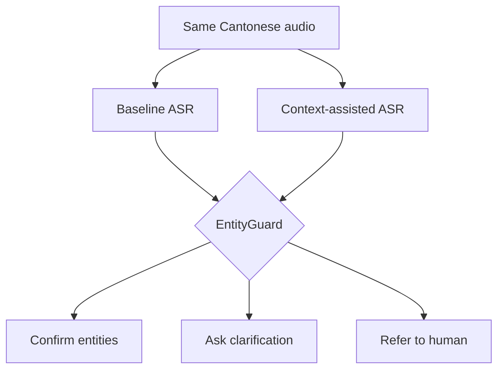

# CantoShield Mini｜粵語保險語音安全研究

> When “20%” becomes “2%”, or “not covered” becomes “covered”, a transcript can change a financial decision. CantoShield Mini shows how domain context and a mandatory human checkpoint can reduce that risk.

> 當「兩成」聽成「百分之二」，或者「唔保障」少咗個「唔」，一份 transcript 就可能改變財務決定。CantoShield Mini 展示保險術語 context 加人手確認，點樣降低呢類風險。

## 結果一覽｜Results at a glance

| 指標 Metric | Baseline | Context-assisted |
|---|---:|---:|
| 關鍵概念保留率 Safety-critical concept recall | 93.8% (45/48) | **97.9% (47/48)** |
| 每句完整保留全部概念 Cases preserving every expected concept | 85.0% (17/20) | **95.0% (19/20)** |
| 完成轉錄 Completed transcripts | 20/20 | 20/20 |

Context 在今次 pilot 修正兩個實質問題：

- **U18：**補回 `pre-existing condition` 入面遺漏咗嘅 `pre-`，避免改變已有病相關語意。
- **U19：**將錯誤嘅 `劇霧` 修正為語意正確嘅 `化療`。

但 Context 並非萬能：U15 兩個版本都未能正確辨識正式術語 `訂明診斷成像檢測`，因此系統必須停止並轉交人手。

In this pilot, context fixed two material errors: it restored the missing `pre-` in U18 and recovered chemotherapy as `化療` in U19. Context did not solve U15, so the safe outcome is human review.

## 我哋測試咗乜｜What was tested

20 句合成香港廣東話涵蓋金額、百分比、日期、否定詞、保障語意、VHIS 術語同中英 code-switching。同一段錄音以同一個固定 ASR snapshot 跑兩次：

Twenty synthetic Hong Kong Cantonese utterances covered money, percentages, dates, negation, coverage polarity, VHIS terminology and Cantonese-English code-switching. Each recording was run twice with the same fixed ASR snapshot:

1. **Baseline：**只提供錄音 / audio only.
2. **Context-assisted：**加入精簡香港保險詞表 / the same audio plus a short insurance glossary.
3. **EntityGuard：**唔改 transcript，只決定下一個安全動作 / never rewrites text; it only routes the next safe action.

## 用家會見到乜｜What the user sees

| 狀態 State | 用家體驗 User experience |
|---|---|
| `CONFIRM_ENTITIES` | 畫面列出金額、日期、否定詞同術語，要求確認 / Critical items are shown for explicit confirmation |
| `ASK_CLARIFICATION` | 系統以中立問題再問一次，唔估答案 / The system asks again without guessing |
| `REFER_TO_HUMAN` | 停止自動流程，交由獲授權人員聽返錄音 / Automation stops for an authorised reviewer |

確認 transcript 只代表「系統聽到嘅內容同講者意思一致」，**唔代表保單一定保障、claim 一定批或者一定有得賠**。

Confirming a transcript does **not** confirm coverage, eligibility or claim approval.

## 點解唔只睇逐字準確率｜Why exact-match accuracy is not enough

`二十一／廿一`、標點、空格或者 `覆診／復診` 未必改變意思；相反，漏咗 `pre-` 或 `唔` 就可能係高風險錯誤。評估因此使用 48 個預先定義嘅安全概念，而唔係單靠整句完全相同。

Punctuation and harmless orthographic variants should not count like a missing negation or scope modifier. The evaluation therefore scores 48 pre-defined safety concepts rather than relying on whole-sentence exact match.

## 重要限制｜Important limitations

- 只有一位自願參與者、20句合成內容同安靜環境錄音。
- 冇測試噪音、電話壓縮、多人同時講、不同口音或語速。
- 結果只適用於指定 snapshot：`qwen3-asr-flash-2026-02-10`。
- 呢個係研究展示，唔係保險顧問、承保、理賠或 claim decision system。
- One speaker and 20 clean synthetic utterances cannot support population-level or production accuracy claims.

## 睇詳細資料｜Explore the evidence

- [完整結果與評分方法 / Results and scoring](docs/RESULTS.md)
- [運作流程 / How it works](docs/HOW_IT_WORKS.md)
- [Failure cases](FAILURE_CASES.md)
- [安全設計 / Safety](SAFETY.md)
- [私隱與倫理 / Ethics and privacy](ETHICS.md)
- [商業使用 / Commercial use](COMMERCIAL.md)
- [20句合成 CantoBench 測試集](data/cantobench_v1.csv)

## Privacy-first publication

本展示只包含合成句子、人工核對後嘅去識別化結果、aggregate metrics、圖表同示範程式。聲音、服務憑證同可識別執行資料一律保留喺受控環境。

This showcase contains synthetic text and reviewed, de-identified evidence only. Voice recordings, service credentials and identifiable execution data remain in a controlled environment.

## License

[PolyForm Noncommercial License 1.0.0](LICENSE). Commercial use is not granted.
