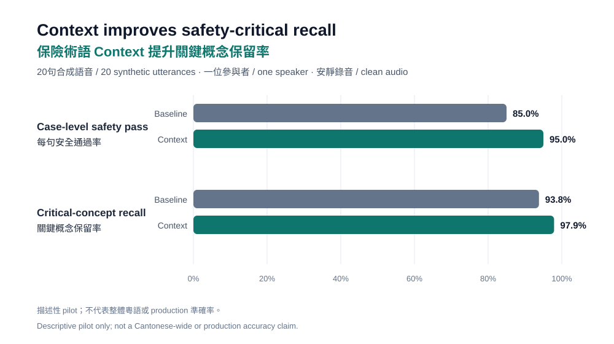
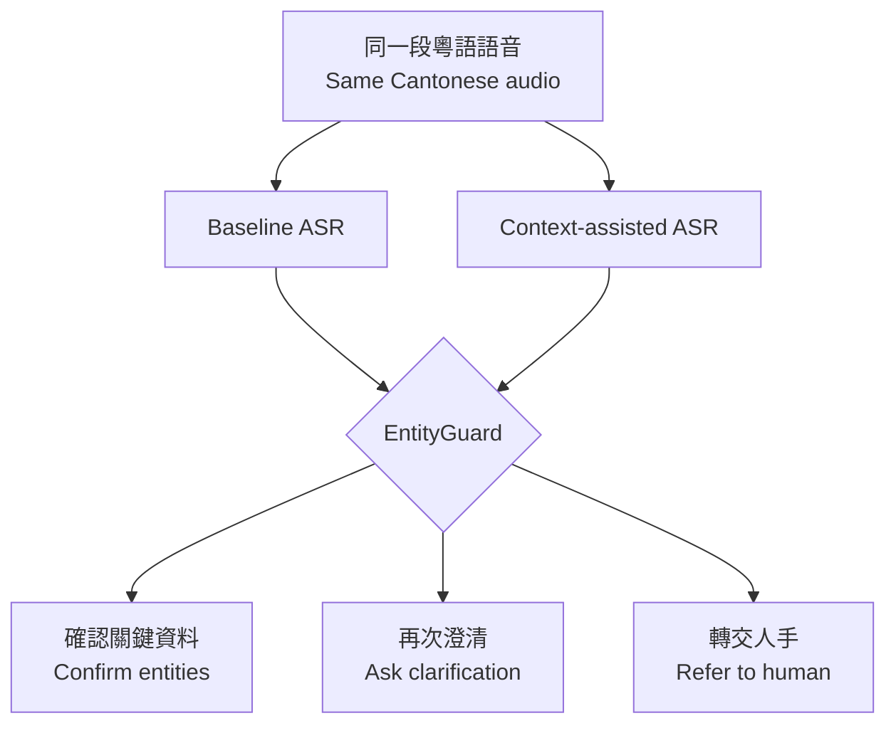

# CantoShield Mini｜粵語保險語音安全研究

> When “20%” becomes “2%”, or “not covered” becomes “covered”, a transcript can change a financial decision. CantoShield Mini demonstrates how insurance glossary context and mandatory human confirmation can reduce that risk.

> 當「兩成」聽成「百分之二」，或者「唔保障」少咗個「唔」，一份轉錄就可能改變財務決定。CantoShield Mini 展示保險術語 context 配合強制人手確認，點樣降低呢類風險。

## 結果一覽｜Results at a glance

| 指標 Metric | Baseline（只提供語音 / audio only） | Context-assisted（加入術語表 / with glossary） | 差異 Difference |
|---|---:|---:|---:|
| 關鍵概念保留率 Safety-critical concept recall | 93.8% (45/48) | **97.9% (47/48)** | +4.1 pp |
| 每句完整保留全部概念 Case-level safety pass | 85.0% (17/20) | **95.0% (19/20)** | +10.0 pp |
| 完成轉錄 Completed transcripts | 20/20 | 20/20 | — |

## 結果點解重要｜Why the result matters

Context-assisted ASR 喺20句入面修正咗兩個會影響意思嘅錯誤，而且冇造成關鍵概念倒退。

Context-assisted ASR corrected two meaning-changing errors among 20 utterances, with no safety-concept regression in this dataset.

- **U18：**`pre-existing condition` 遺漏嘅 `pre-` 得以恢復，保留已有病相關範圍。 / The missing `pre-` was restored, preserving the medical-history scope.
- **U19：**無關詞語 `劇霧` 修正為治療項目 `化療`。 / The unrelated output `劇霧` was recovered as the treatment term `化療` (chemotherapy).

Context 唔係萬能：U15 兩個版本都未能正確辨識 `訂明診斷成像檢測`，安全結果必須係停止自動處理並轉交人手。

Context is not a complete safeguard: both U15 outputs missed `訂明診斷成像檢測`, so the safe outcome is to stop automation and refer the case to a human.

## 展示內容｜What the demonstration covers

20句合成香港廣東話涵蓋金額、百分比、日期、否定詞、保障語意、VHIS術語及中英 code-switching。每段錄音都以同一個固定模型 snapshot 比較兩個條件。

Twenty synthetic Hong Kong Cantonese utterances cover money, percentages, dates, negation, coverage polarity, VHIS terminology and Cantonese-English code-switching. Each recording is compared under two conditions using the same fixed model snapshot.

| 階段 Stage | 內容 Description |
|---|---|
| Baseline | 只提供語音。 / Audio only. |
| Context-assisted | 同一段語音加精簡香港保險術語表。 / The same audio plus a short Hong Kong insurance glossary. |
| EntityGuard | 唔改寫轉錄，只決定下一個安全動作。 / Never rewrites the transcript; it only selects the next safe action. |

## 用家會見到乜｜What a user sees

| 狀態 State | 中文體驗 | English experience |
|---|---|---|
| `CONFIRM_ENTITIES` | 顯示金額、日期、否定詞及術語，要求明確確認 | Critical items are shown for explicit confirmation |
| `ASK_CLARIFICATION` | 以中立問題再問一次，唔代替用家揀答案 | The system asks again without choosing an interpretation |
| `REFER_TO_HUMAN` | 停止自動流程，交由獲授權人員覆核 | Automation stops for an authorised reviewer |

確認轉錄只代表系統聽到嘅內容同講者意思一致，**唔代表保單保障、資格或 claim 已獲批**。

Confirming a transcript only confirms what was heard. It does **not** confirm coverage, eligibility or claim approval.

## 點解唔只睇逐字準確率｜Why exact-match accuracy is not enough

`二十一／廿一`、標點、空格或者 `覆診／復診` 未必改變意思；相反，漏咗 `pre-` 或 `唔` 就可能係高風險錯誤。評估因此使用48個預先定義嘅安全概念，而唔係單靠整句完全相同。

Punctuation and harmless orthographic variants should not count like a missing negation or scope modifier. The evaluation therefore scores 48 pre-defined safety concepts instead of relying on whole-sentence exact match.

## 重要限制｜Important limitations

| 中文 | English |
|---|---|
| 只包含一位自願參與者、20句合成內容及安靜環境錄音。 | The dataset contains one consenting speaker, 20 synthetic utterances and clean audio. |
| 未測試噪音、電話壓縮、多人同時講、不同口音或語速。 | Noise, telephone compression, overlapping speakers, accents and varied speaking rates were not tested. |
| 結果只適用於 `qwen3-asr-flash-2026-02-10` 呢個指定 snapshot。 | Results apply only to the named `qwen3-asr-flash-2026-02-10` snapshot. |
| 呢個係描述性研究展示，唔係整體粵語準確率、production benchmark 或保險決策系統。 | This is a descriptive research demonstration, not a Cantonese-wide accuracy claim, production benchmark or insurance decision system. |

## 詳細資料｜Explore the evidence

- [完整結果與評分方法｜Results and scoring](docs/RESULTS.md)
- [運作方式｜How it works](docs/HOW_IT_WORKS.md)
- [失敗案例｜Failure cases](FAILURE_CASES.md)
- [安全設計｜Safety](SAFETY.md)
- [私隱與倫理｜Ethics and privacy](ETHICS.md)
- [商業使用｜Commercial use](COMMERCIAL.md)
- [20句雙語合成測試集｜20-item bilingual synthetic benchmark](data/cantobench_v1.csv)

## 資料邊界｜Data boundary

公開內容只包括合成文字、人工核對後嘅去識別化結果、aggregate metrics、圖表及示範程式。聲音、服務憑證、完整原始輸出及可識別執行資料不會公開。

The public material contains synthetic text, reviewed de-identified outcomes, aggregate metrics, charts and demonstration code. Voice recordings, service credentials, complete raw outputs and identifiable execution data are not published.

## 授權｜License

[PolyForm Noncommercial License 1.0.0](LICENSE)。只授予條款所容許嘅非商業用途；commercial use is not granted.

