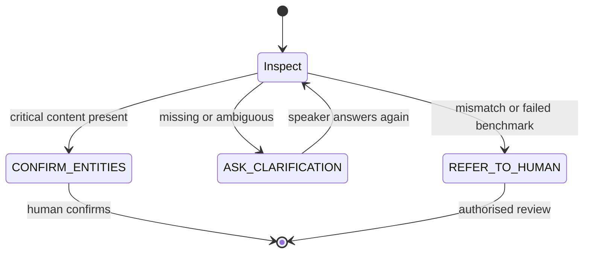

# 運作流程｜How it works

## 1. 同一段聲音，公平比較｜Paired comparison

每段聲音以完全相同模型同參數處理兩次。唯一實驗變數係有冇加入精簡香港保險術語 context。

Each audio item is processed twice with the same model and settings. The only experimental variable is the glossary context.

## 2. 保留原始輸出｜Preserve raw evidence

研究流程唔會用 LLM 潤飾 transcript。正規化只用於評分，唔會覆蓋原始輸出。

The research pipeline never asks an LLM to polish a transcript. Normalisation is a separate comparison layer and never overwrites evidence.

## 3. EntityGuard 分流｜Safety routing

EntityGuard 檢查金額、百分比、日期、年齡、否定詞、claim certainty、保障語意同保險／醫療術語，再輸出三種狀態：

EntityGuard detects high-risk content and produces one of three states:

## 4. 離線 gold-aware 評估｜Offline benchmark

Runtime guard 唔知道講者原本應該講乜。如果 Baseline 同 Context 一齊錯，兩者比較可能產生假安全感。離線 CantoBench 因此用預先定義概念檢查共同失敗，例如 U15。

The runtime guard cannot know the intended sentence. An offline gold-aware benchmark is required to catch shared failures where both ASR conditions agree on the wrong term.

## 5. 人手仍然係控制點｜Human oversight remains mandatory

三個狀態都唔會直接產生保障、理賠或承保決定。即使 transcript 經確認，仍要按正式保單條款同既定業務流程處理。

None of the three states authorises a coverage, claim or underwriting decision. Verified transcription and insurance adjudication are separate tasks.
