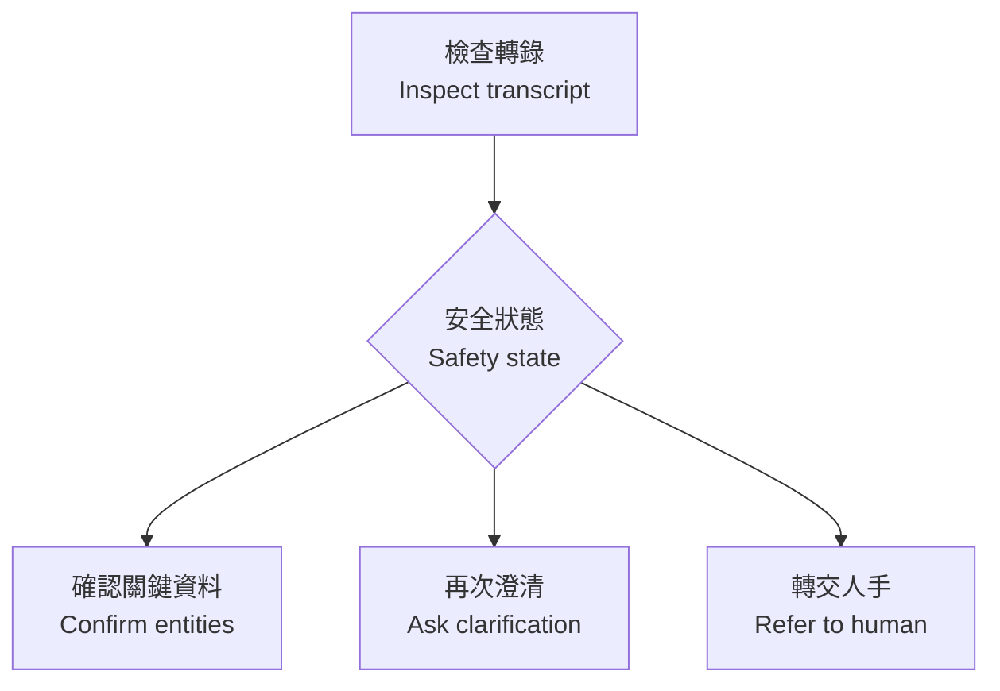

# 運作方式｜How it works

## 1. 配對比較｜Paired comparison

每段聲音以同一模型同設定處理兩次，唯一實驗變數係有冇加入精簡香港保險術語 context。

Each audio item is processed twice with the same model and settings. The only experimental variable is whether the short Hong Kong insurance glossary is supplied.

## 2. 保留原始意思｜Preserve the original meaning

顯示嘅轉錄唔會經 LLM 潤飾。正規化只用於離線評分，唔會覆蓋模型原始輸出。

The displayed transcript is never polished by an LLM. Normalisation is used only for offline scoring and never overwrites the model output.

## 3. 安全分流｜Safety routing

EntityGuard 檢查金額、百分比、日期、年齡、否定詞、claim certainty、保障語意及保險／醫療術語。EntityGuard checks high-risk content and returns one of three next actions.

三個狀態都唔會作出保障、承保或理賠決定。None of the three states makes a coverage, underwriting or claim decision.

## 4. 捕捉共同錯誤｜Catch shared errors

單靠比較 Baseline 同 Context 仍然可能漏錯，因為兩邊可以一齊聽錯。離線 benchmark 會用預先定義嘅概念檢查共同失敗，例如 U15。

Comparing Baseline with Context can still miss an error when both outputs are wrong. The offline benchmark checks pre-declared concepts to catch shared failures such as U15.

## 5. 人手控制點｜Human control point

確認轉錄同判斷保險資格係兩個獨立步驟。即使文字經確認，仍要按正式保單條款同獲授權業務流程處理。

Transcript confirmation and insurance adjudication are separate tasks. Even confirmed text must still be handled under the formal policy wording and authorised business process.

